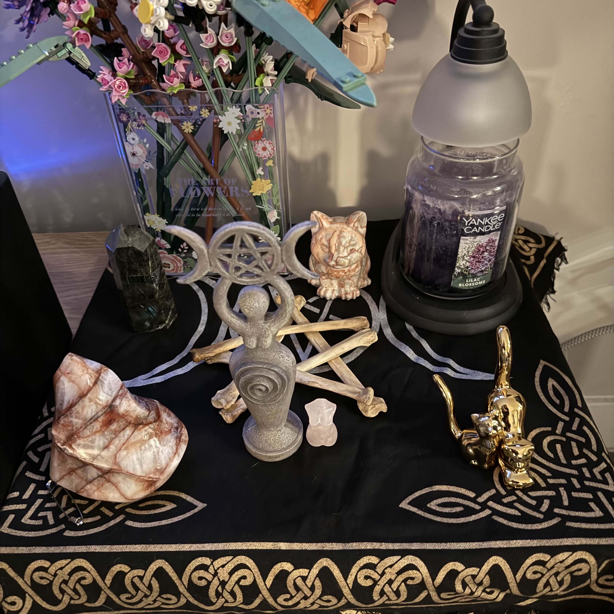

### My Vacation So Far
Hellooooo!!! It's been a hot minute since my last post, I've definitely been allowing myself the time to be lazy (and allowing things to pile up so I have more interesting things to talk about). To be honest, it's been nice! I'm allowed to relax and not take too much seriously. The last couple days, I've been vegging out on the couch with one of my roommates binging *True Blood* while she plays *Skyrim* and I knit. Except knitting isn't going too well, because the damn hat I'm working on isn't getting smaller while I decrease the stitches, which is getting annoying... But I guess I should count the stitches I have now and actually make sure there are less than I started with. Anywho!
#### Packing and Moving
I've mentioned previously that my husband and I will be moving into a house with two of my school friends, and we found a store with cardboard boxes! They sell small boxes for $1, medium for $1.50, and large boxes (which are huge) for $1.75, so it was a friggin steal! Right now the boxes I got are sitting in the truck bed until I grab our hand-truck to bring them inside, but I'm excited to get all the small crap I've collected over the last couple years organized and into boxes! Also, while I've started slowly packing, I'm excited to figure out where all of my crystals went to and wrap them up all nice in the bubble wrap! The last thing I want is to break even more crystals 😅 One roommate already broke my mini-penis fluorite crystal (it was in a bad spot, and he yeeted it onto the floor with a cable). Now he owes me a new mini-penis! 😄
#### Paganism - My Altar
Speaking of packing and finding things.. Since roommate A has moved into our apartment (while we wait to find a house), she is also a practicing pagan, we've bonded over that and have both set up separate altars on my media center! Here's mine: 

Here I have my altar (keeping A's altar private), where I have dedicated space to The Morrigan, Freyja, and Aphrodite. I spent time with my Crow Tarot deck to see if The Morrigan and Freyja want to work with me, and their responses were quite apt. The Morrigan said I need to quit being lazy and get a hold on my anger (which has come up once again because I'm not used to dealing with not-so-mature brains who can't handle my overly sarcastic remarks...which can be mean to people who don't know me well enough, or people who are especially sensitive in a specfic moment), but she is still willing to work with me as long as I am active in my devotion. Freyja I have already worked with in my past, before I became too lazy and forgotten our relationship. Her tarot reading told me I need more patience in my everyday life, which I agree with, and trying to keep a pin on to hold myself accountable. I haven't yet done a reading for Aphrodite, which I feel sorry for. I'm about to work out with roommate A and then shower, so I can be clean for Aphrodite's reading later. I'll be back in two shakes!! 
. . .
And for you, just two lines of text!

Anyways, Aphrodite does *not* seem to particularly want to work with me, and my tarot essentially told me "hey, two deities is enough, figure shit out with them first" sooo I'm gonna stick with that. I'm planning on moving my altar to a better and bigger spot so I can have enough space from both Freyja and The Morrigan. I did give a shot of whiskey to The Morrigan as an offering, and I'm currently waiting for her to let me know when she's done with it (which I expect to just... be my intuition telling me when lol).
#### Paganism - My Beliefs
Recently I went to an event called "The Queer Artists Market" at Under The Umbrella Bookstore (an adorably gay local bookstore) where I bought a book of "Poetry as Spellcasting" (by Tamiko Beyer, Destiny Hemphill, & Lisbeth White) that I plan on using with both Freyja and The Morrigan, as well as TWO new tarot decks!! One of them is the Dark Days tarot by Wren Jane Brignac, and the This Might Hurt tarot by Isabella Rotman. They are both *gorgeous* works of art and I am so excited to work with them! I have an older deck called the Crow Tarot by MJ Cullinane, which I use to communicate with The Morrigan (as the animal she loves and uses the most are crows and ravens). Right now I'm feeling the pull to use my This Might Hurt deck with Freyja, and the Dark Days deck when I need both deities or for any other readings unrelated to them. You might be wondering who these deities are and what they do....
##### The Morrigan - The Great Queens
My friend has a hunch that I've been working with The Morrigan for a while now and just didn't know it, and I kind of believe her. The Morrigan is the goddess of war, fate, death, sovereignty, and prophecy. A lot of offerings to her involve setting a shot of whiskey on your altar for her, but also non-material things like reclaiming your sovereignty (in the words of John Beckett: *"They tell us who we’re supposed to be, then they sell us an identity. They keep us in fear so we’ll vote for them. They keep us outraged so we’ll keep watching and listening and clicking. We have to consciously and intentionally take back what is ours. ... Own your mind. Own your soul. Own your thoughts. Reclaim your sovereignty."*), as well as acts of social justice - something I have been doing for quite a few years now. This all includes donating hats and scarves I've crocheted to the local mutual-aid organization, giving my spare cash (that I purposely carry for this) to the homeless folks on my walks to school, and even going to a store just to buy soda for those same folks. Although I can't currently go to protests, those are also included! 
##### Freyja
Freyja is a goddess I had followed years ago, but unfortunately I let her down and had forgotten about her. I hadn't *literally* forgotten her existence in my life, but I let other things get in the way and hold my attention. Freyja is the Norse goddess of love, beauty, fertility, war, wealth, and magic, and she is depicted being pulled in a chariot by large cats!! That was originally why I was pulled to her, but later realized it was for a more important purpose. In her, I have gained self-love and learned intentional self-care, as well as reigning in my anger issues and self-sabotaging actions. Now that I am back and getting into the groove of following Freyja, I plan on using make-up as a form of offering to her (because she is a goddess of beauty). Another offering idea I have is giving my cats fruits (strawberries. blueberries, black berries and raspberries!) which they love! I definitely need to write things down so I don't always feel so lost or forgetful. I also need to earn Freyja's trust again, because I don't doubt that my abandonment hurt.

Anywho, this post has gotten quite long!! Thank you so much for reading, TTFN!!